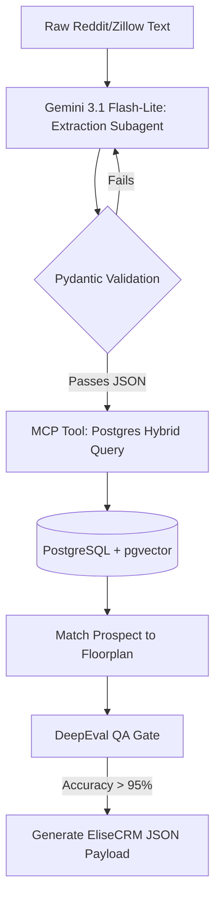

# Phase 1 - Prospect Intent Analysis (Lead-to-Tour Funnel)

## 1. Objective
Build an autonomous agent pipeline that parses unstructured, informal prospect queries (slang, implicit constraints) and structures them into definitive scheduling parameters for the EliseCRM Guided Tour system using PostgreSQL for semantic matching.

## 2. Public Dataset Definition
**Source:** Scraped Reddit (e.g., `r/bostonhousing`, `r/ApartmentLiving`) and Zillow listing comments.
**Features/Fields Available:**
* `raw_text`: The prospect's message.
* `timestamp`: When the query was made.
* `context_tags`: Thread flair or listing metadata.

## 3. Insights & Functional Outcomes
* **Insights Required:** Implicit timeline extraction (e.g., "ASAP" = < 14 days), pet policy extraction (e.g., "ESA", "Pit mix"), and budget boundaries.
* **Functional Outcome:** A validated JSON payload (`LeadSchema`) that can be safely POSTed to a Property Management System (PMS) to auto-book a tour.

## 4. Agentic Workflow Implementation Steps
1.  **Ingestion & Embedding:** Python script uses `pandas` to load the dataset. Text is embedded using a specialized text-embedding model and stored in a PostgreSQL table using the `pgvector` extension.
2.  **Intent Extraction (Subagent):** Gemini 3.1 Flash-Lite processes the `raw_text` using structured outputs (`response_schema`) to guarantee JSON adherence for the prospect's parameters.
3.  **Vector & Relational Search:** The extracted intent triggers an MCP Tool (`postgres-query`). This executes a hybrid query: filtering relational data (budget < $3000) while performing a cosine similarity search via `pgvector` to match the "vibe" of the prospect to the property description.
4.  **Validation Gate:** Confident AI (`deepeval`) runs the `GEval` metric on the output to ensure no hallucinated amenities were added to the prospect's profile.

## 5. Tooling & Libraries
* **Data Processing:** `pandas`, `psycopg2-binary`.
* **Database:** PostgreSQL with `pgvector`.
* **LLM Orchestration:** `google-genai` Python SDK (Gemini 3.1 Flash-Lite), `pydantic`.
* **Evaluation:** `deepeval`.

## 6. Architecture Diagram

