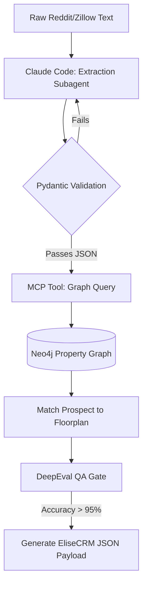

# Phase 1 - Prospect Intent Analysis (Lead-to-Tour Funnel)

## 1. Objective
Build an autonomous agent pipeline that parses unstructured, informal prospect queries (slang, implicit constraints) and structures them into definitive scheduling parameters for the EliseCRM Guided Tour system.

## 2. Public Dataset Definition
**Source:** Scraped Reddit (e.g., `r/bostonhousing`, `r/ApartmentLiving`) and Zillow listing comments.
**Features/Fields Available:**
* `raw_text`: The prospect's message (e.g., "Need a 2bd dog friendly spot by Sept 1 under 3k").
* `timestamp`: When the query was made.
* `context_tags`: Thread flair or listing metadata (e.g., "Multifamily", "Sublet").

## 3. Insights & Functional Outcomes
* **Insights Required:** Implicit timeline extraction (e.g., "ASAP" = < 14 days), pet policy extraction (e.g., "ESA", "Pit mix"), and budget boundaries.
* **Functional Outcome:** A validated JSON payload (`LeadSchema`) that can be safely POSTed to a Property Management System (PMS) to auto-book a tour without human pre-screening.

## 4. Agentic Workflow Implementation Steps
1.  **Ingestion:** Python script uses `pandas` to load the scraped CSV/JSON dataset.
2.  **Intent Extraction (Subagent):** Claude 4.6 Sonnet processes the `raw_text` using a strict system prompt enforced by `dspy` (or direct API with `response_format` JSON schema).
3.  **Knowledge Graph Mapping:** The extracted intent is passed to a Neo4j Graph RAG via `neo4j-driver`. The graph checks if the prospect's extracted constraints (e.g., Budget $3k, 1 Dog) match the synthetic property nodes.
4.  **Validation Gate:** Confident AI (`deepeval`) runs the `GEval` metric on the output to ensure no hallucinated amenities were added to the prospect's profile.

## 5. Tooling & Libraries
* **Data Processing:** `pandas`, `numpy`.
* **LLM Orchestration:** `anthropic` Python SDK, `pydantic` (for schema validation).
* **Graph/State:** `neo4j-driver`.
* **Evaluation:** `deepeval`.

## 6. Architecture Diagram

