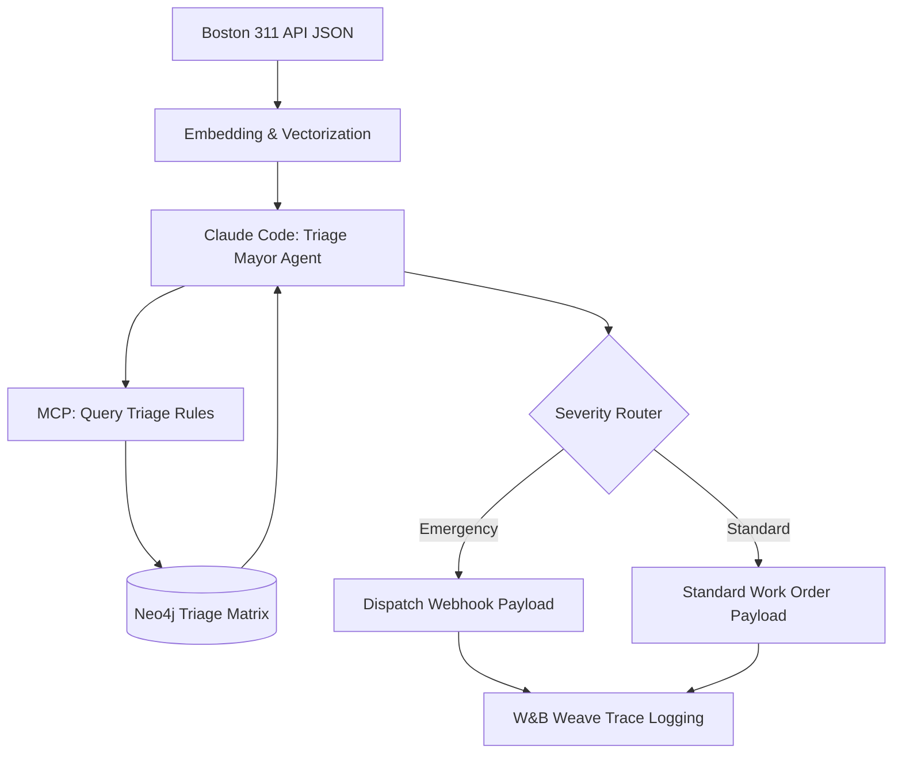

# Phase 2 - High-Precision Maintenance Triaging (The Boston 311 Engine)

## 1. Objective
Develop an escalation-tree model that classifies raw, ambiguous maintenance complaints into strict severity levels and routing categories (Plumbing, HVAC, Electrical) without human triage.

## 2. Public Dataset Definition
**Source:** Boston 311 Open Data (Housing/Property Maintenance cases).
**Features/Fields Available:**
* `CASE_ENQUIRY_ID`: Unique identifier.
* `OPEN_DT`: Timestamp of complaint.
* `REASON` / `TYPE`: Target variables (e.g., "Housing/Sanitation", "Building/Property").
* `Description`: Unstructured tenant text (e.g., "Water is coming through the ceiling fixture").

## 3. Insights & Functional Outcomes
* **Insights Required:** Distinguishing between subjective frustration ("It's freezing in here") and legal habitability violations ("Heat is broken, 40 degrees inside"). 
* **Functional Outcome:** An automated webhook payload triggering either an "Emergency Dispatch" (immediate contractor ping) or a "Standard Work Order" (queued for on-site staff).

## 4. Agentic Workflow Implementation Steps
1.  **API Ingestion:** Use `sodapy` to pull real-time 311 data from the Boston Socrata API.
2.  **Semantic Clustering:** Initial pass using an embedding model (e.g., `text-embedding-3-small` or local HuggingFace) to cluster similar complaints.
3.  **Triage Agent:** Claude 4.6 Sonnet evaluates the description against a "Severity Matrix" stored in the Neo4j Graph.
4.  **MCP Routing:** An MCP Tool (`triage-router`) mimics sending the structured work order to Yardi/Entrata.
5.  **Observability:** Every routing decision is logged in W&B Weave with the exact reasoning trace.

## 5. Tooling & Libraries
* **Data Retrieval:** `sodapy`, `requests`.
* **LLM/Embeddings:** `anthropic`, `sentence-transformers`.
* **Integration:** `@modelcontextprotocol/sdk` (Python).
* **Observability:** `weave`.
* **Evaluation:** `deepeval` (specifically testing the `AnswerRelevance` to the strict severity matrix).

## 6. Architecture Diagram

