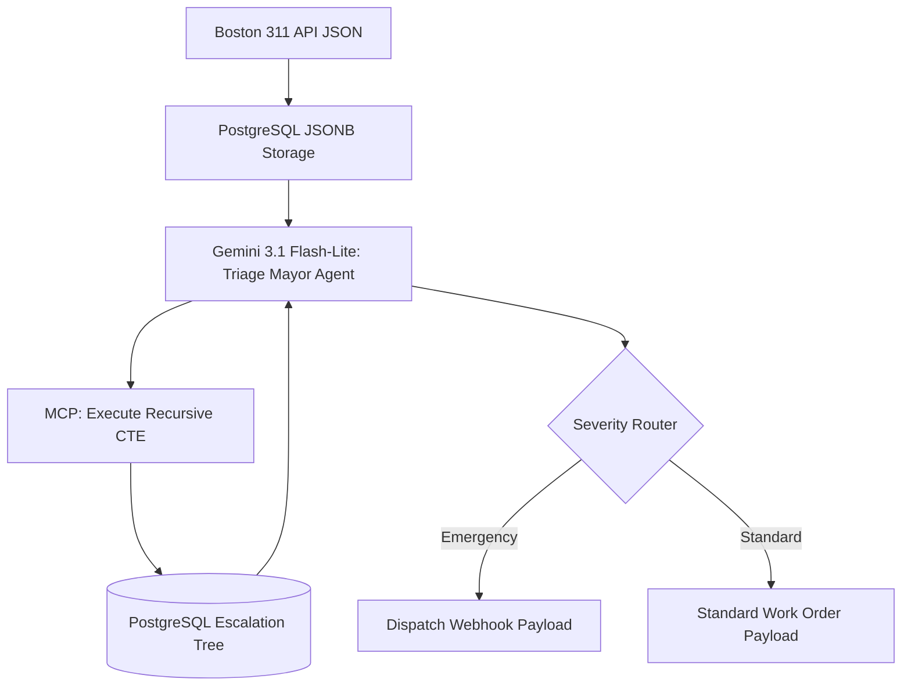

# Phase 2 - High-Precision Maintenance Triaging (The Boston 311 Engine)

## 1. Objective
Develop an escalation-tree model that classifies raw, ambiguous maintenance complaints into strict severity levels and routing categories without human triage, using recursive PostgreSQL joins for the decision tree.

## 2. Public Dataset Definition
**Source:** Boston 311 Open Data (Housing/Property Maintenance cases).
**Features/Fields Available:**
* `CASE_ENQUIRY_ID`: Unique identifier.
* `OPEN_DT`: Timestamp of complaint.
* `REASON` / `TYPE`: Target variables.
* `Description`: Unstructured tenant text (e.g., "Water is coming through the ceiling fixture").

## 3. Insights & Functional Outcomes
* **Insights Required:** Distinguishing between subjective frustration and legal habitability violations.
* **Functional Outcome:** An automated webhook payload triggering either an "Emergency Dispatch" or a "Standard Work Order".

## 4. Agentic Workflow Implementation Steps
1.  **API Ingestion:** Use `sodapy` to pull real-time 311 data from the Boston Socrata API into a PostgreSQL `JSONB` column for raw storage.
2.  **Severity Tree Setup:** The escalation logic is stored in PostgreSQL using an adjacency list model.
3.  **Triage Agent:** Gemini 3.1 Flash-Lite acts as the "Mayor" agent. It takes the text and uses an MCP tool to execute a `WITH RECURSIVE` CTE in PostgreSQL. This traverses the triage tree (e.g., Plumbing -> Leak -> Active -> Ceiling = Emergency).
4.  **MCP Routing:** An MCP Tool (`triage-router`) mimics sending the structured work order to Yardi/Entrata based on the CTE output.
5.  **Observability:** Every routing decision is logged in W&B Weave with the exact reasoning trace.

## 5. Tooling & Libraries
* **Data Retrieval:** `sodapy`, `requests`, `sqlalchemy`.
* **LLM/Embeddings:** `google-genai` SDK (Gemini 3.1 Flash-Lite).
* **Integration:** `@modelcontextprotocol/sdk` (Python).
* **Observability:** `weave`.
* **Evaluation:** `deepeval`.

## 6. Architecture Diagram

