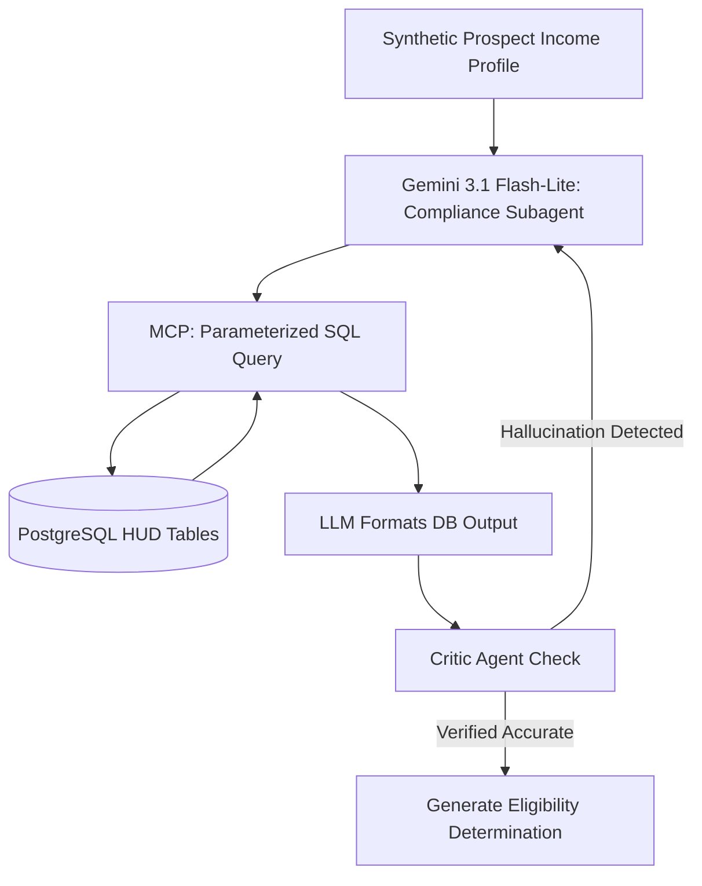

# Phase 3 - Affordable Housing & Voucher Compliance Logic

## 1. Objective
Build a "Zero-Fault" compliance validator that calculates affordable housing eligibility using strict relational database checks rather than LLM reasoning, eliminating math hallucinations.

## 2. Public Dataset Definition
**Source:** HUD (Department of Housing and Urban Development) APIs.
**Features/Fields Available:**
* `Fair Market Rents (FMR)`: By Zip Code and Bedroom Count.
* `Income Limits (AMI)`: 30%, 50%, 80% median income thresholds by family size.

## 3. Insights & Functional Outcomes
* **Insights Required:** Precise mathematical comparison between a prospect's stated income, family size, and dynamic federal limits.
* **Functional Outcome:** A definitive `is_eligible` boolean and a mathematically sound explanation of the gap between the voucher FMR and the asking rent.

## 4. Agentic Workflow Implementation Steps
1.  **Reference Data Sync:** A chron-job subagent uses `requests` to pull HUD FMR and Income data, structuring it into heavily indexed PostgreSQL relational tables.
2.  **Calculation Subagent:** When a query arrives, Gemini 3.1 Flash-Lite constructs a parameterized SQL query via the MCP tool (`hud-calculator`). 
3.  **Strict Math Enforcement:** The database performs the actual math (`SELECT (asking_rent - fmr) AS gap FROM...`). The LLM is strictly used to translate the database's numerical return into an empathetic text response for the tenant.
4.  **Critic Gate:** A separate agent checks the prompt injection vulnerability and asserts compliance before outputting the final JSON.

## 5. Tooling & Libraries
* **API/Data:** `requests`, `psycopg2`.
* **Database:** PostgreSQL (Standard Relational).
* **Agent Tools:** Custom MCP Server for parameterized SQL.
* **Testing:** `pytest`, `deepeval` (Faithfulness metric).

## 6. Architecture Diagram

