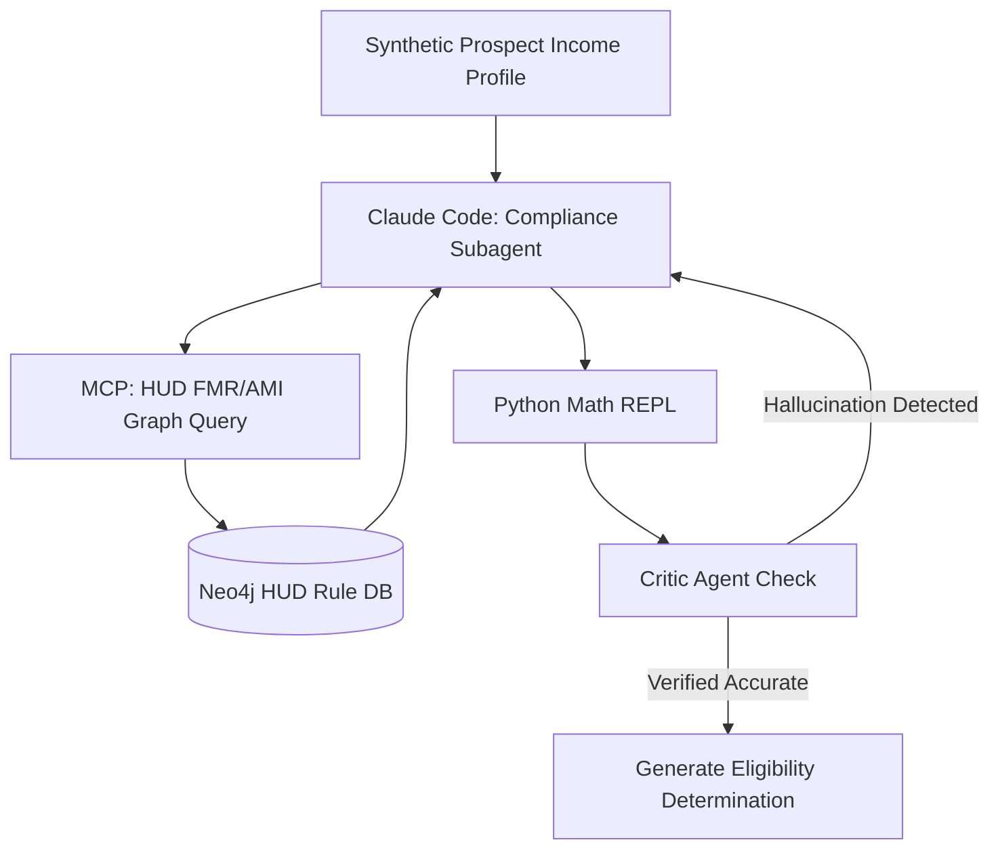

# Phase 3 - Affordable Housing & Voucher Compliance Logic

## 1. Objective
Build a "Zero-Fault" compliance validator that calculates affordable housing eligibility and voucher coverage without mathematical hallucinations or Fair Housing Act violations.

## 2. Public Dataset Definition
**Source:** HUD (Department of Housing and Urban Development) APIs.
**Features/Fields Available:**
* `Fair Market Rents (FMR)`: By Zip Code and Bedroom Count.
* `Income Limits (AMI)`: 30%, 50%, 80% median income thresholds by family size.

## 3. Insights & Functional Outcomes
* **Insights Required:** Precise mathematical comparison between a prospect's stated income, family size, and dynamic federal limits for the specific zip code.
* **Functional Outcome:** A definitive `is_eligible` boolean and a mathematically sound explanation of the gap between the voucher FMR and the asking rent.

## 4. Agentic Workflow Implementation Steps
1.  **Reference Data Sync:** A chron-job subagent uses `requests` to pull 2026 HUD FMR and Income data, structuring it into the Neo4j Knowledge Graph.
2.  **Calculation Subagent:** When a prospect query arrives, Claude uses an MCP tool (`hud-calculator`) to query the exact thresholds from the graph. 
3.  **Strict Math Enforcement:** The agent MUST use Python `ast` or a secure Python REPL via MCP to execute the actual income calculations. LLM native math generation is strictly forbidden to avoid hallucination.
4.  **Critic Gate:** A separate "Critic Agent" reviews the calculation trace and asserts compliance before outputting the final JSON.

## 5. Tooling & Libraries
* **API/Data:** `requests`, `json`.
* **Graph:** `neo4j-driver`.
* **Agent Tools:** Python REPL tool implementation.
* **Testing:** `pytest` (for deterministic math tests), `deepeval` (Faithfulness metric to ensure explanation matches math).

## 6. Architecture Diagram

