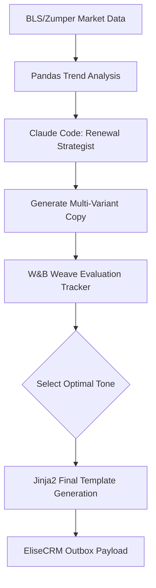

# Phase 4 - Market-Driven Renewal & Pricing Automation

## 1. Objective
Create an agentic workflow that structures lease renewal offers, balancing property revenue goals with hyper-local market rent trends to maximize "Renewal Velocity."

## 2. Public Dataset Definition
**Source:** BLS (Bureau of Labor Statistics) CPI for Rent of Primary Residence & local Zumper API market median data.
**Features/Fields Available:**
* `Date`: Time series data.
* `CPI_Index`: Macro rent inflation metrics.
* `Median_Rent`: Local zip code median by unit type.

## 3. Insights & Functional Outcomes
* **Insights Required:** Determine if a property's proposed 5% rent increase is justified by local CPI data or if it risks tenant churn because local market medians have dropped.
* **Functional Outcome:** Dynamically generated text templates that explain the renewal increase mathematically and empathetically to secure a "Promise to Pay" or "Intent to Renew."

## 4. Agentic Workflow Implementation Steps
1.  **Market Ingestion:** `pandas` processes the time-series CPI and Zumper data.
2.  **Contextual Prompt Generation:** Claude 4.6 Sonnet takes the base rent, the proposed increase, and the local market context to generate 3 different styles of renewal emails (Direct, Empathetic, Value-Add).
3.  **A/B Test Logging:** W&B Weave is used to track the generation prompts. (In a real environment, this tracks conversion; here, it tracks generation quality).
4.  **Template Engine:** The final selected prompt output is passed through `jinja2` to create a strictly formatted email/SMS template string.

## 5. Tooling & Libraries
* **Data Analysis:** `pandas`, `statsmodels` (for simple trend analysis).
* **Templating:** `jinja2`.
* **Observability:** `weave` (Weights & Biases).
* **LLM:** `anthropic`.

## 6. Architecture Diagram

