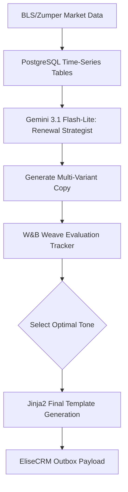

# Phase 4 - Market-Driven Renewal & Pricing Automation

## 1. Objective
Create an agentic workflow that structures lease renewal offers, balancing property revenue goals with hyper-local market rent trends to maximize "Renewal Velocity."

## 2. Public Dataset Definition
**Source:** BLS (Bureau of Labor Statistics) CPI for Rent of Primary Residence & local Zumper API market median data.
**Features/Fields Available:**
* `Date`: Time series data.
* `CPI_Index`: Macro rent inflation metrics.
* `Median_Rent`: Local zip code median by unit type.

## 3. Insights & Functional Outcomes
* **Insights Required:** Determine if a proposed rent increase is justified by local CPI data or if it risks tenant churn.
* **Functional Outcome:** Dynamically generated text templates that explain the renewal increase mathematically and empathetically.

## 4. Agentic Workflow Implementation Steps
1.  **Market Ingestion:** Process time-series CPI data and store it in PostgreSQL using standard date/time indexing (or TimescaleDB extension if scale requires).
2.  **Contextual Prompt Generation:** Gemini 3.1 Flash-Lite uses the time-series trends pulled via SQL to generate 3 different styles of renewal emails.
3.  **A/B Test Logging:** W&B Weave tracks the generation prompts and variants. 
4.  **Template Engine:** The selected prompt output is passed through `jinja2` to create a strictly formatted string.

## 5. Tooling & Libraries
* **Data Analysis:** `pandas`, `sqlalchemy`.
* **Templating:** `jinja2`.
* **Observability:** `weave`.
* **LLM:** `google-genai` SDK (Gemini 3.1 Flash-Lite).

## 6. Architecture Diagram

