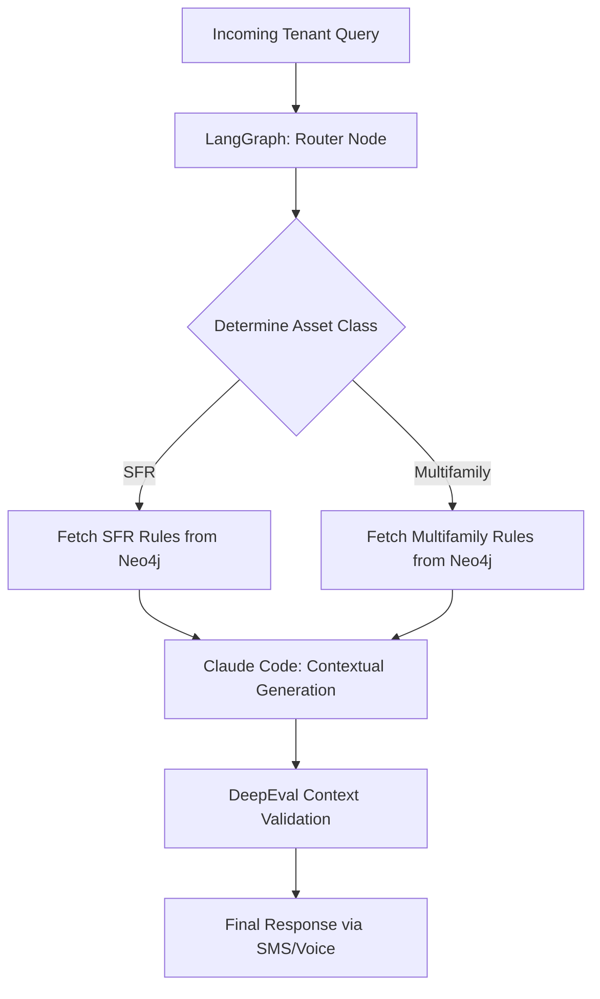

# Phase 5 - Cross-Asset Localization (Multifamily vs. SFR)

## 1. Objective
Implement an advanced routing mechanism that fundamentally changes the automation logic based on the asset class, ensuring Single Family Rental (SFR) queries aren't treated like high-rise Multifamily queries.

## 2. Public Dataset Definition
**Source:** American Housing Survey (AHS) Microdata.
**Features/Fields Available:**
* `Structure_Type`: 1-unit detached, 50+ units, etc.
* `Deficiencies`: Common issues (e.g., roof leaks for SFR vs. elevator breakdowns for Multifamily).
* `Amenities`: Shared vs. Private.

## 3. Insights & Functional Outcomes
* **Insights Required:** Mapping physical property constraints to conversational boundaries (e.g., EliseAI should tell an SFR tenant they are responsible for landscaping, but tell a Multifamily tenant that groundskeeping will handle it).
* **Functional Outcome:** A semantic routing layer (LangGraph) that intercepts all incoming queries and injects the correct "Asset Ruleset" before generation.

## 4. Agentic Workflow Implementation Steps
1.  **Ontology Creation:** Parse AHS data to create distinct nodes in Neo4j for `AssetClass: SFR` and `AssetClass: Multifamily`, each linked to specific `Responsibility` nodes.
2.  **Stateful Routing:** Use `langgraph` to build a state machine. Node 1 classifies the asset type from the incoming webhook. Node 2 fetches the specific ruleset from Neo4j.
3.  **Context Injection:** Claude 4.6 Sonnet generates the response strictly constrained by the retrieved ruleset.
4.  **DeepEval Testing:** Run synthetic queries (e.g., "My grass is dying") against both an SFR profile and a Multifamily profile, ensuring diametrically opposed, correct responses.

## 5. Tooling & Libraries
* **Routing/State:** `langgraph`, `langchain-core`.
* **Graph RAG:** `neo4j-driver`, `langchain-community` (Neo4j wrapper).
* **LLM:** `anthropic`.
* **Evaluation:** `deepeval` (Contextual Precision metric).

## 6. Architecture Diagram

