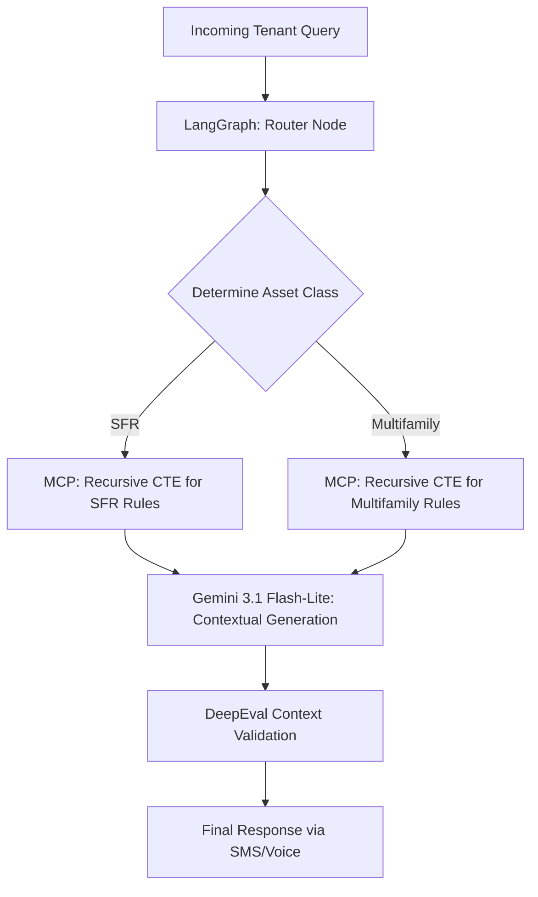

# Phase 5 - Cross-Asset Localization (Multifamily vs. SFR)

## 1. Objective
Implement an advanced routing mechanism that fundamentally changes the automation logic based on the asset class, using recursive SQL joins to map specific asset dependencies.

## 2. Public Dataset Definition
**Source:** American Housing Survey (AHS) Microdata.
**Features/Fields Available:**
* `Structure_Type`: 1-unit detached, 50+ units, etc.
* `Deficiencies`: Common issues.
* `Amenities`: Shared vs. Private.

## 3. Insights & Functional Outcomes
* **Insights Required:** Mapping physical property constraints to conversational boundaries.
* **Functional Outcome:** A semantic routing layer that intercepts all incoming queries and injects the correct "Asset Ruleset" before generation.

## 4. Agentic Workflow Implementation Steps
1.  **Ontology Creation:** Parse AHS data into a PostgreSQL hierarchical table structure (e.g., `id`, `parent_id`, `rule_text`).
2.  **Stateful Routing:** Use `langgraph` to build a state machine. Node 1 classifies the asset type. Node 2 uses an MCP tool to run a `WITH RECURSIVE` SQL query to fetch all applicable rules up the hierarchy (e.g., Unit 4B -> Building 4 -> Multifamily -> General Laws).
3.  **Context Injection:** Gemini 3.1 Flash-Lite generates the response strictly constrained by the retrieved PostgreSQL ruleset.
4.  **DeepEval Testing:** Run synthetic queries against both an SFR profile and a Multifamily profile.

## 5. Tooling & Libraries
* **Routing/State:** `langgraph`, `langchain-core`.
* **Database:** PostgreSQL (`WITH RECURSIVE`).
* **LLM:** `google-genai` SDK (Gemini 3.1 Flash-Lite).
* **Evaluation:** `deepeval` (Contextual Precision metric).

## 6. Architecture Diagram

